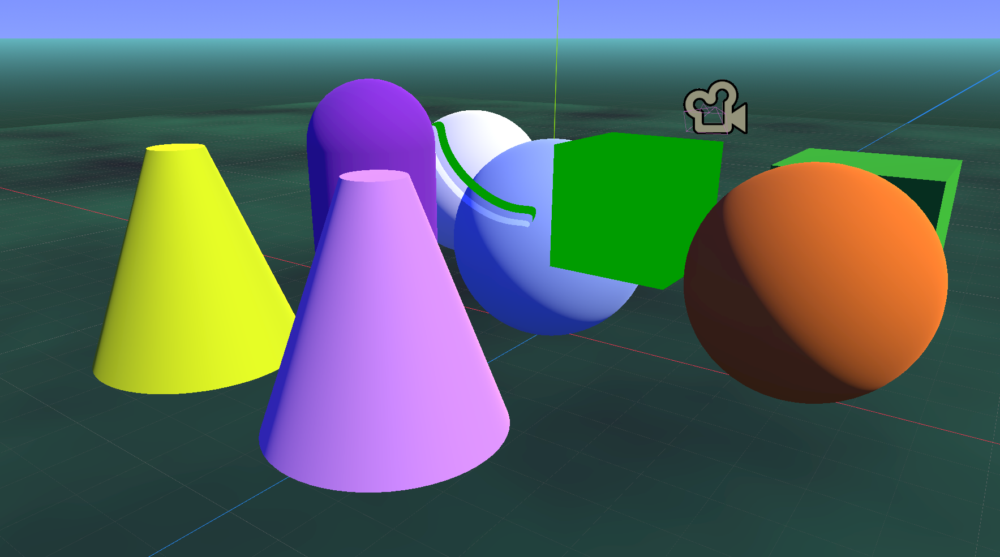
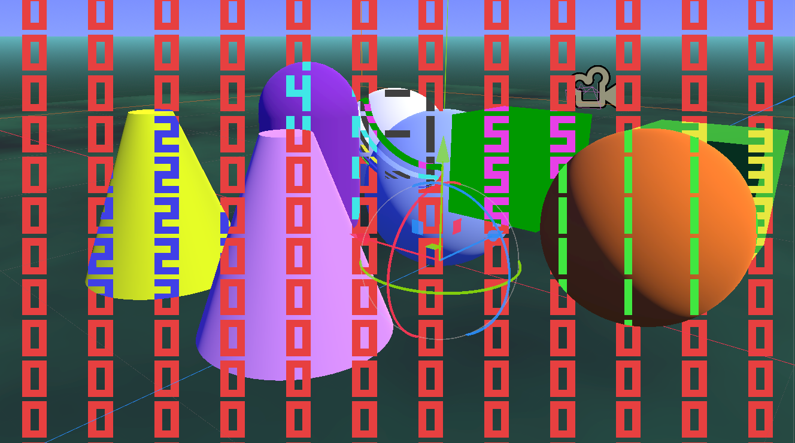

# Selective post-processing via material ID masking on a second visibility layer

I put this demo together in Godot 4.3 after researching how to accomplish selective mesh-based post-processing and not finding a detailed explanation.

This technique is based on the material ID masking from (https://github.com/danilw/godot-utils-and-other) to selectively apply custom post-process effects to certain 3D objects and leave others untouched.  This shader removes the need to instantiate a duplicate node in the SubViewport for each mesh we want to assign a material ID to and sync their positions each frame, which can be cumbersome if we have many mobile meshes.  We will use the red channel of the SubViewport to encode a unique value for each material ID.  We can set the material ID for a node per camera by using a shader parameter in the material overlay and later retrieve it in the post-processing shader from the mask texture.  Credit to Danil for the original material ID logic.

- Per camera shader logic using CAMERA_VISIBLE_LAYERS based on a video tutorial by Game Dev Warden: (https://www.youtube.com/watch?v=F9hGCD9NHwk)
- QuadMesh technique based on the advanced post-processing documentation: (https://docs.godotengine.org/en/stable/tutorials/shaders/advanced_postprocessing.html)

The post_processor.gdshader file can be extended for a variety of different post-processing effects. The demo only applies custom effects to material IDs 4 and 5.

## HOW TO USE:

**Step 1:** Create the "post_processor.tscn" scene we will use for applying effects (You can skip this step if you download the scene from the demo):
- Create a new empty scene with a MeshInstance3D as the root node. We'll name it "PostProcessor".
- Set its mesh to a QuadMesh, set the width and height to 2 and set *Flip Faces* to true.
- Set the QuadMesh *Resource->Local to Scene* to true and set *Geometry->Extra Cull Margin* to the maximum.
- **IMPORTANT!** Set the *Node->Process->Priority* of the QuadMesh to a positive number. It must be higher than whatever the process priority is set to on your target camera or the masking will lag a frame behind and look very bad in motion.
- Set the mesh material to a new ShaderMaterial and set the material *Resource->Local to Scene* to true also.
- Save this material as "post_processor.tres".
- Set the shader to post_processor.gdshader but leave it shared by keeping *Local to Scene* as false.
- Add a child node of type SubViewport. We'll name it "MaskViewport" and set its *Handle Input Locally* to false.
- Add a child node to MaskViewport of type Camera3D. We'll name it "MaskCamera".
- Set the *Cull Mask* property of MaskCamera to only be lit up for layer 2 (you can choose a different layer if you change the *mask_layer_val* const in mask_mat.gdshader but we will use layer 2 for demonstration).
- Add a new Environment to MaskCamera and set the *Background->Mode* to *Custom Color* with the default black color.
- Return to *PostProcessor->Material* and open *Shader Parameters*.
- Set the mask texture shader parameter to a new ViewportTexture that will target MaskViewport.
- **IMPORTANT!** Click the mask texture again and select *Make Unique*. Set the mask texture resource to *Local to Scene* as well.
- Attach the post_processor.gd script to the root QuadMesh.
- Save this scene as "post_processor.tscn" and close the scene. We will use it later.

**Step 2:** Set up the material overlays and render layers for your geometry nodes:
- On any mesh that you want to apply post-processing effects to, or occlude effects applied to other meshes, open the *GeometryInstance3D->Material Overlay* properties.
- Attach a new material overlay of type ShaderMaterial. If you have other material overlays, you can attach it in the *Next Pass* property instead.
- Set the shader to "mask_mat.gdshader" and set *Shader Parameters->Material ID* to a valid ID number.
	- Material ID of 0 is the default and also the ID that appears on the 3D background where no objects are visible.
	- Material ID of 1-5 is valid in the demo, but you can extend the script with additional IDs if needed.
- You can save this material for convenience in attaching the same material ID to other meshes. In the demo these are saved in the "mat_masks" folder.
- Scroll down in the inspector and set the *VisualInstance3D->Layers* property for the node to include both Layers 1 and 2 (the primary layer and the mask layer).
- Repeat this step for any other meshes that will have a material ID or occlude meshes with a material ID.

**Step 3:** Attaching post processor effects to your target camera:
- Open or create and setup the scene that will contain your primary camera.
- Instantiate a child scene under your primary camera using the "post_processor.tscn" node.
- Select the PostProcessor node and open *Mesh->Material->Shader Parameters*.
- Set *Debug View* to true to display the material ID numbers for each fragment in-editor and in-game to allow for easier debugging.

**Note:** While the PostProcessor node is visible, you will be unable to select other nodes from the 3D editor view. There are 3 ways to address this:
- You can hide the node when you want to select objects in the 3D view and unhide to display effects again.
- You can enable *Show list of selectable nodes at position clicked* button above the 3D view.
- If using 4.4+, you should be able to lock the PostProcessor node to select other nodes and still view effects after this commit: (https://github.com/godotengine/godot/issues/84764)

**Note:** The PostProcessor node script will default to rendering to its parent node if it is a Camera3D, but you can reassign the *target_camera* exported property if it gets moved or was instantiated under a different node.

**Warning:** Materials that are improperly configured will lead to the awkward visual effects demonstrated in the demo:
- The blue sphere in the center is only visible on the primary layer and has no material overlay shader. It receives the post-processing effects meant for the geometry behind it.
- The white sphere in the corner is visible on both layers but with no material overlay shader. It receives a range of mask IDs at different angles including invalid IDs.
- The pink cone is correctly set to material 0 and will obstruct post-processing effects meant for geometry behind it.
